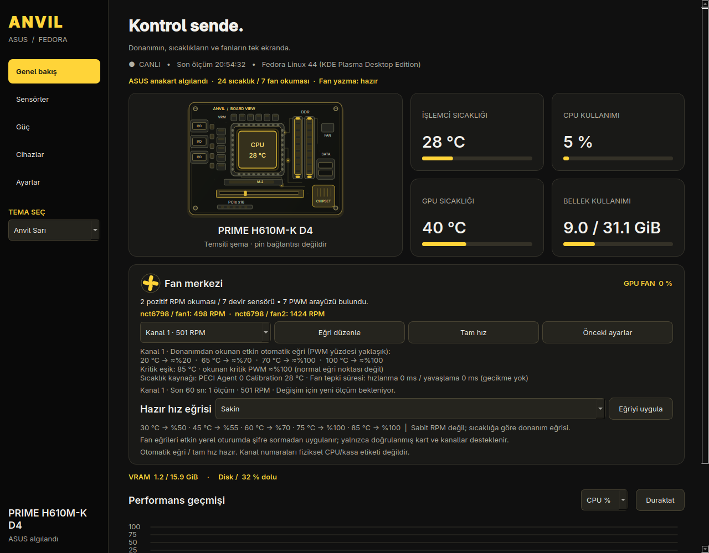

# ANVIL CONTROL

**ASUS sistemleri için Fedora’da yerel donanım kontrolü.** Anakart ve Linux’un sunduğu özellikler otomatik algılanır; desteklenmeyen donanıma ayar yazılmaz.

[](https://github.com/Tubix777/anvil-control/releases)
[](LICENSE)

[İndir](https://github.com/Tubix777/anvil-control/releases) · [Değişiklikler](CHANGELOG.md) · [Hata bildir](https://github.com/Tubix777/anvil-control/issues/new/choose) · [Katkı](CONTRIBUTING.md)



[Gün Işığı tema önizlemesi](docs/daylight.png)

## Donanım kapsamı

Anvil, anakart modelini DMI’dan okur ve Linux’un sunduğu sıcaklık, fan ve güç arayüzlerini gösterir. Intel `coretemp` ile AMD `k10temp` / `zenpower` işlemci sıcaklıkları okunur. NVIDIA GPU ölçümleri NVML’ye, AMD GPU ölçümleri `amdgpu` sysfs arayüzlerine, RGB cihazları isteğe bağlı OpenRGB’ye bağlıdır. Mevcut aygıta göre bazı değerler gösterilmeyebilir.

| Özellik | Kapsam |
| --- | --- |
| Anakart, sensör, fan devri ve güç profilleri | Linux sürücüsü / servisinin sunduğu arayüzler |
| Grafik, RAM ve depolama | Genel Linux ölçümleri |
| NVIDIA GPU | İsteğe bağlı NVML sürücüsü |
| AMD GPU | `amdgpu` sürücüsünün sunduğu salt-okunur sysfs ölçümleri; gerçek AMD donanımında henüz sınanmadı |
| RGB | OpenRGB’nin algıladığı aygıt ve modlar |
| Yazılabilir anakart fan eğrisi | Şimdilik yalnızca aşağıdaki, fiziksel olarak doğrulanmış H610M-K D4 profili |

Bu nedenle uygulama farklı ASUS sistemlerinde genel izleme için kullanılabilir; her modelde aynı sensörler veya yazılabilir fan kontrolü olduğu iddia edilmez. Yeni bir fan profili ancak anakart, kontrolcü, kanal ve sıcaklık kaynağı gerçek donanımda doğrulandıktan sonra eklenir.

**Cihazlar → Bu sistemde kullanılabilir özellikler** tablosu, o bilgisayarda bulunan sıcaklık ve fan okumalarını, PWM arayüzlerini, GPU telemetrisini, güç profillerini ve fan yazma durumunu ayrı ayrı gösterir. PWM dosyasının görünmesi tek başına güvenli yazma desteği anlamına gelmez. Hazır eğriler her ASUS kartta incelenebilir, ancak yalnızca doğrulanmış kanalda ve paket yardımcısı kuruluysa uygulanabilir.

Doğrulanmamış ASUS kartlarında hazır eğri **önizlemesi**, kartın mevcut donanım eğrisi değildir. Anvil bu kartların mevcut eğrisini göstermez veya fanlarına yazmaz; sürücü sunuyorsa fan devir sensörleri yine izlenebilir.

## Kurulum — Fedora 44 KDE

[Sürümlerden](https://github.com/Tubix777/anvil-control/releases) RPM’yi indirin:

```bash
sudo dnf install ./anvil-control-0.13.8-1.fc44.noarch.rpm
anvil-control
```

Uygulama menüsünden **Anvil Control** olarak da açılabilir. RPM, kernel sensör sürücüsünü sonraki açılışlarda yüklemek üzere ayarlar. RGB için isteğe bağlı `sudo dnf install openrgb` kurun, ardından **Cihazlar → Cihazları tara** yolunu kullanın. GUI’yi root olarak çalıştırmayın. Paket kurulumu yönetici yetkisi ister; kurulumdan sonra desteklenen fan işlemleri etkin yerel oturumda ayrıca şifre sormaz.

Kaldırma: `sudo dnf remove anvil-control`. Paketi kaldırmadan önce fan ayarı değiştirdiyseniz **Önceki ayarlar** düğmesiyle başlangıç eğrisini geri yükleyin.

## Arayüz

Beş bölüm: **Genel bakış**, **Sensörler**, **Güç**, **Cihazlar** (RGB, envanter ve tanılama) ve **Ayarlar**. Ana sayfada canlı ölçümler ve fan paneli; ayrıntılarda arama, grafikler, CSV ölçümleri ve isteğe bağlı JSON tanılama bulunur. Veriler yerelde kalır; kendiliğinden gönderilmez.

**Sol menü → TEMA SEÇ** alanında Anvil Sarı, Gece Mavisi, Orman Yeşili, Bakır Kızılı, Mor Gece, Grafit ve Gün Işığı seçilebilir. Aynı seçim Ayarlar bölümünde de bulunur. Tema anında değişir ve sonraki açılışta korunur. KDE uygulama menüsündeki Anvil Control başlatıcısı görev çubuğuna sabitlenebilir; RPM özel simgeyi de kurar.

Ana sayfadaki anakartın katmanlı üstten görünüşü CPU, RAM, PCIe, M.2 ve diğer başlıca bileşenleri temsili olarak gösterir; gerçek pin/bağlantı şeması değildir. Anakart izlerindeki ışık, CPU vurgusu ve grafikteki yeni ölçüm halkası dekoratif animasyonlardır. **Ayarlar → Arayüz animasyonları** seçeneği bunları ve diğer hareketleri kapatır; gizli sayfalarda anakart animasyonu çalışmaz.

Ana sayfadaki fan merkezinde **Sakin**, **Dengeli** ve **Yüksek soğutma** hazır sıcaklık eğrileri seçilebilir; **Eğriyi uygula** seçili, doğrulanmış anakart kanalına yazar. Bunlar sabit RPM hedefleri değildir. 75 ve 85 °C noktalarında tüm hazır eğriler %100 PWM uygular. **Önceki ayarlar** bu açılıştaki ilk değişiklik öncesine döner. GPU fanı için yazma denetimi sunulmaz.

Genel fan listesi yalnız 0’dan yüksek RPM okuyan sensörleri sıralar. Sıfır veya geçersiz devir okuması, bilgisayardaki bütün fiziksel fanların durmuş olduğunu kanıtlamaz; panel bu durumda pozitif RPM okunmadığını belirtir.

Doğrulanmış fan kanallarının seçiminde anlık RPM gösterilir. Yalnız bir kanal dönüyorsa başlangıçta o öne alınır; elle seçtiğiniz kanal korunur. Seçili kanalın donanımdan okunan **mevcut eğrisi** ve varsa PECI kaynak sıcaklığı ile fan tepki süreleri hazır eğri önizlemesinden ayrı görünür. Bu değerler ani fan hızlanmasını incelemeye yardımcı olur; fan tepki süresini bu sürümde değiştirmez.

NCT6798 sürücüsü bir kanal için isteğe bağlı **ikincil sıcaklık kaynağı** bildiriyorsa seçim ve okunabilen sensör sıcaklığı da gösterilir. Alanın hiç sunulmaması devre dışı olduğu anlamına gelmez; `0` sürücüye göre devre dışı/atanmamış seçimi, geçersiz değer ise okunamayan seçim olarak belirtilir. İkincil kaynağın fan hızındaki değişime gerçekten neden olduğu bu okumayla kanıtlanmaz. Tam hız modunda otomatik eğri etkin değildir.

Fan eğrisi ve son devir değişimi metinleri ekran okuyucularında da seçili kanal ve son ölçümle birlikte güncellenir; sabit açıklamalar canlı değerleri gizlemez.

NCT6798 Smart Fan IV’te okunan ilk dört nokta normal eğridir; beşinci nokta ayrı bir kritik sıcaklık eşiğidir. Arayüz kritik PWM geri okumasını gösterir, ancak eşikte mutlaka %100 devir olacağını iddia etmez. Kritik eşik dördüncü noktadan düşük sıcaklıkta bulunabilir; bu yüzden beşinci nokta normal artan eğri adımı gibi yorumlanmamalıdır.

Seçili doğrulanmış kanalın son 60 saniyedeki RPM aralığı ve son iki geçerli ölçüm arasındaki fark da ana sayfada görünür. Bu geçmiş yalnızca uygulama açıkken bellekte tutulur, raporlara eklenmez ve ani artışın nedenini tek başına açıklamaz. Başka ASUS modellerinde yazılabilir kanal doğrulanmadıkça bu kanal geçmişi gösterilmez; genel sensör okumaları yine görülebilir.

İzleme duraklatılırsa veya ölçüm alınamazsa genel fan devir listesi, seçili kanal RPM’si ve donanım eğrisi **son okuma** olarak işaretlenir; geçmiş canlıymış gibi gösterilmez. Yeniden başarılı ölçüm alındığında işaret kalkar ve RPM değişimi yeni bir geçmişten hesaplanır.

İlk başarılı ölçümden önce ve izleme duraklatıldığında ya da ölçüm hata verdiğinde fan ayarı yazan düğmeler kapalıdır. Açık kalmış bir eğri penceresinden gelen işlem de iptal edilir; yeni başarılı ölçümden sonra yazma seçenekleri yeniden açılır. Kanal ve son okunmuş eğri salt okunur biçimde incelenebilir.

Fan yazma yardımcısı kurulu olmasa veya başka bir donanım işlemi sürse de mevcut kanallar arasında geçiş yapıp eğrileri salt okunur biçimde inceleyebilirsiniz. Böyle durumlarda fan ayarı yazan düğmeler kapalı kalır.

Fan işlem mesajında hedef kanal numarası görünür. Özel eğri düzenleyicisi açıkken kanal seçimi değişirse uygulama yazmayı iptal eder; yeni kanal için düzenleyiciyi yeniden açın.

Fan değişiklikleri için yalnızca `/usr/libexec/anvil-fan-helper` polkit eylemi, **etkin yerel oturumda** şifresiz izinlidir; etkin olmayan ve uzaktan oturumlara izin verilmez. Bu, yalnızca uygulamanın düğmelerini değil, aynı oturumdaki başka programların aynı yardımcıyı çağırmasını da kapsar. Yardımcı yalnızca doğrulanmış kart/kanal ve güvenli eğrileri kabul eder; bu izin genel root erişimi vermez. Ortak kullanılan bilgisayarlarda bu yetki modelini göz önünde bulundurun.

## Doğrulanmış fan desteği

Fedora 44 KDE üzerinde **ASUS PRIME H610M-K D4 / NCT6798**, kanal 1 ve 2 için eğri yazma, tam hız, geri okuma ve önceki ayarlara dönüş gerçek donanımda test edildi. Tam hız denemesinde yaklaşık 700 → 1.724 RPM ve 1.830 → 3.154 RPM okundu; testten sonra başlangıç ayarları geri yüklendi.

Yazma profili kesin anakart adına ve NCT6798’e kilitlidir. Yalnızca PWM, PECI sıcaklık kaynağı, sınırlı sıcaklık/devir aralığı ve güvenli eğri kabul edilir. Son iki eğri noktası %100 olmalıdır; fan durdurma veya düşük sabit hız yoktur. Donanım eğriyi uygular; uygulamanın açık kalması gerekmez. Yedek root’a ait `/run/anvil-control` altında tutulur ve yeniden başlatmada silinir. Kanal numarası kasadaki CPU / SYS etiketini garanti etmez.

Mevcut BIOS eğrisinin son kritik noktası, uygulamanın yeni eğri yazma kurallarından farklı olabilir. Uygulama okunan beş noktayı gösterirken bozuk veya aralık dışı PECI/eğri verisi olan kanalı yazmaya hazır olarak sunmaz; diğer sağlıklı kanallar bundan etkilenmez.

Aynı sistemde birden fazla NCT6798 denetleyici kimliği varsa kanal eşlemesi belirsiz sayılır ve yazma denetimleri açılmaz. Bu kural ayrıcalıklı fan yardımcısının donanım doğrulamasıyla aynıdır.

Başka ASUS modellerinde sensörler görünse dahi fan ayarı yazımı kapalıdır; o kart henüz doğrulanmamıştır.

## Test ve sınırlar

```bash
python3 -m unittest discover -s tests -v
QT_QPA_PLATFORM=offscreen PYTHONPATH=. python3 tests/smoke_ui.py
```

61 birim testi ve gerçek sensör telemetrisiyle beş bölümlü arayüz testi. Smoke testi yalnızca mevcut sistemde çalışır. Bu bağımsız alpha proje ASUS/Fedora tarafından onaylanmamıştır. Anakart çizimi temsili şemadır, pin bağlantısı değildir. AMD GPU desteği sysfs fikstürleriyle sınandı; gerçek AMD donanımında henüz doğrulanmadı. JSON tanılama raporunu paylaşmadan önce içeriğini inceleyin; raporda kart/BIOS, PCI ve sensör bilgileri bulunur.

## English

Local Fedora hardware monitoring and controls for ASUS systems. Board identity and available Linux sensor interfaces are discovered dynamically, with a per-system capability matrix. NVIDIA NVML and experimental read-only AMDGPU sysfs telemetry are supported. Seven persistent themes are available. Writable motherboard fan curves remain restricted to the physically validated PRIME H610M-K D4 / NCT6798 profile; monitoring may work on other ASUS boards without fan-write support. Experimental alpha.

## Kaynaklar

- [Linux NCT6775/NCT6798 hwmon sürücüsü](https://www.kernel.org/doc/html/latest/hwmon/nct6775.html)
- [ASUS PRIME H610M-K D4 özellikleri](https://www.asus.com/au/motherboards-components/motherboards/prime/prime-h610m-k-d4/techspec/)
- [NVIDIA NVML](https://docs.nvidia.com/deploy/nvml-api/) · [OpenRGB](https://openrgb.org/)
- [Linux AMDGPU telemetri arayüzleri](https://docs.kernel.org/gpu/amdgpu/thermal.html)
